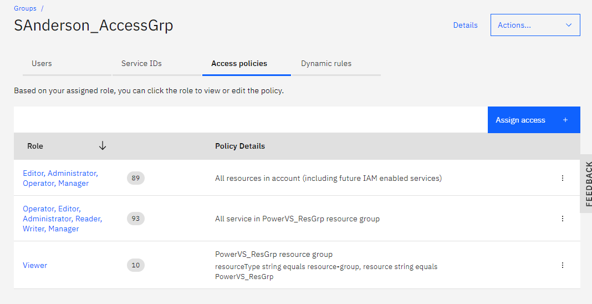

# Starting from Scratch


## Terraform Settings
Terraform is installed and `terraform init` has been run in the directory containing the configuration files.  
The `terraform.tfvars` file is created to contain any secrets and variable values.


## IBM Cloud CLI Install
Install of the `ibmcloud` utility can be found [here](https://cloud.ibm.com/docs/cli?topic=cli-getting-started).  
I also alias `ibmcloud` to `ic` for brevity:  
`#>alias ic=ibmcloud`

Lastly, add the ibmcloud autocompletion script:  
`#>echo source /usr/local/ibmcloud/autocomplete/zsh_autocomplete >> ~/.zshrc`


## IAM Settings
The user is created and assigned to an `Access Group`.  This Access Group is where permissions are created to control resources contained in the `Resource Group`.  

Resources (VM instances, COS instances, etc) are put into a `resource group`.  

Users are assigned access groups and will get their permissions to services through `access policies` associated with those access groups. 

In this example, `sanderson@convergeone.com` is assigned to access group `SAnderson_AccessGrp` and that access group has access policies that define the permissions.




## Get the Cloud Instance ID
In order to get the `Cloud Instance ID` run the command:

`>ibmcloud pi service-list`
This will return information about the existing services.  For this example our output looks like this:
```
#>ic pi service-list
Listing services under account ConvergeOne as user sanderson@convergeone.com...
ID                                                                                                                    Name
crn:v1:bluemix:public:power-iaas:us-south:a/4fd273b6abb24f46946eb4636d009691:a4325e24-3aa0-4b8b-b4f5-c300605cef4c::   C1-PSVS
```
The 'cloud instance id' is the alpha-numeric number between the colons `a4325e24-3aa0-4b8b-b4f5-c300605cef4c`

Set the target service using the command 
```
ic pi st crn:v1:bluemix:public:power-iaas:us-south:a/4fd273b6abb24f46946eb4636d009691:a4325e24-3aa0-4b8b-b4f5-c300605cef4c::
Targeting service crn:v1:bluemix:public:power-iaas:us-south:a/4fd273b6abb24f46946eb4636d009691:a4325e24-3aa0-4b8b-b4f5-c300605cef4c::...
```

